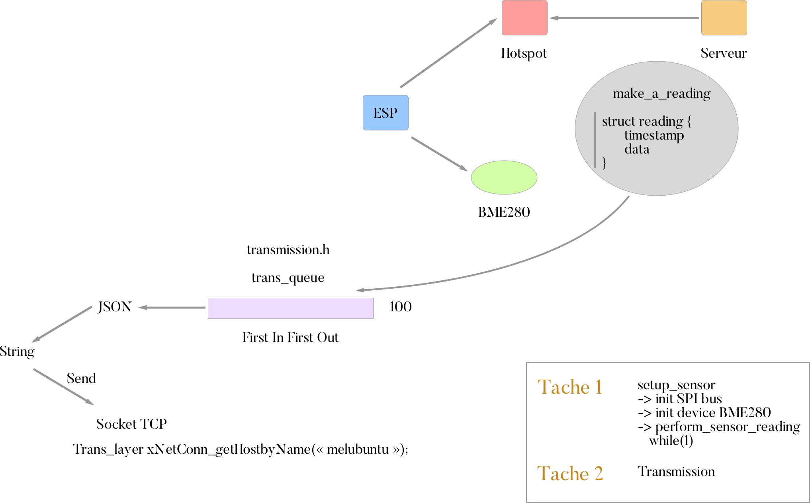

# IoT-Labs-2018

IoT labs for Institut Galilée and Efrei students

# GPIO ports

| SPI    | GPIO_NUM | BME   | PIN |
| ------ | -------- | ----- | --- |
| _CLK_  | 18       | _SCL_ | D18 |
| _MOSI_ | 3        | _SDA_ | RX0 |
| _CS_   | 5        | _CSB_ | D5  |
| _MSIO_ | 19       | _SDO_ | D19 |

# Project Structure



# Description

* This project implements a simple collect-transmit schema. An ESP32 will be responsible of collecting measures from one or optionally multiple sensors, then send them to a server, in the same local network.

* Communication is based on the Light-weight Internet Protocol [(LwIP)](https://savannah.nongnu.org/projects/lwip/) stack, which is a small independent implementation of the TCP/IP protocol suite that has been initially developed by Adam Dunkels. This library is provided along with the ESP-IDF, so no need to include it.

# Get the latest updates

It is strongly recommended that you clone the repository rather than downloading it. This way, you can get latest updates easily. You can use for that the following commands:

```
$ git clone https://github.com/HamidiMassinissa/iot-lab-2018.git
```

Getting latest updates:

```
$ git pull origin master
```

# Evaluation

## Minimal project

Source code is provided but there are missing parts that you have to complete. These missing parts are those indicated with a comment of the form `// TODO failwith "Students, this is you job!"` or this instuction, `rc = ENOSYS;`. Note that `ENOSYS` is the POSIX error code for "Function not implemented".

Your job then, is to complete the missing parts in order to get the ESP32 collect measures from the `BME280`, format and send them correctly to the server via HTTP/TCP/IPv4/WiFi stack.

## Extensions

Here you have a list of possible extensions that you can implement. Note that there is no implicit order at all in the following list!

### Connecting Multiple Sensors

### i2c Communication

Implementing sensor readings over i2c serial communication protocol.

### Application Protocols

Add support for MQTT and CoAP application protocols. You can make use of any available library.

### Implementing Transmissions over BLE

Take a look at `phy_layer.c`.

### Secure Communication

ESP-IDF allow to perform secure communication through `mbedtls` library. This library provides an implementation of the TLS and SSL protocols and the respective cryptographic algorithms and support code required. Take a look [here](https://tls.mbed.org/kb/how-to/mbedtls-tutorial) for instructions to get started with `mbedtls` and [here](https://tls.mbed.org/api/ssl_8h.html) for the API.

### Network Protocols

Add support for 6LowPAN, which is the adaptation layer used to send IPv6 packets over constrained physical interfaces like BLE, ZigBee (802.15.4), etc.

### Handle Limited Queue Size

Measures read from sensors are placed into a global queue (`sensor_readings_queue`), take a look at `transmission.h`, in order to be sent later by the `perform_transmissions` task. The size of the queue being limited, what should you do when it becomes full, when for example, connexion is broken temporarily? One solution is to get rid of old measures, not satisfactory. Another solution is to exploit the capabilities of the ESP32 which provides a virtual file system that allow you to persist data in the flash memory.

# Submission Instructions
## For Efrei students
* Submissions are open on [Moodle](https://www.myefrei.fr/moodle/login/index.php). All details are there and a message has been sent to everybody;
* You have until april 15th (23:59) to submit your work;
* All electronic components (ESPs,BMEs) have to be returned to the Efrei reception desk at the command of Massinissa Hamidi. I will bring them back at the end of april.

## For Institut Galilée students
* You have until april 22nd (23:59) to submit your work;
* Your work must include:
   1. A report;
   2. A link to a 4 minutes video (you can upload a video to Youtube in private mode [link](https://support.google.com/youtube/answer/157177?co=GENIE.Platform%3DDesktop&hl=en), or any other platform (vimeo, etc.));
   3. Source code (or a link to a git repository).
* Submit a zip archive containing the above listed components to ao@lipn.univ-paris13.fr (carbon-copy hamidi@lipn.univ-paris13.fr);
* All electronic components (ESPs,BMEs) have to be returned to desk (B309 Institut Galilée) at the command of Massinissa Hamidi or (B305 Institut Galilée) at the command of Aomar Osmani. The deadline being the end of april.
* Evaluation of the projects will be held either on april 23rd, 24th or 25th. Please consider filling the [framadate survey](https://framadate.org/2rou1NmVMPZcKo3X). Evaluation day will be communicated to you via this README on april 20th;
* In order to be effective, before the evaluation process each group must be ready, so there will be two classrooms.

# Get involved

Some protocols, like Multipath-TCP, UDP-Light, are in experimental status and not yet included in LwIP. If you want to be involved in Free Software development for Internet of Things, this constitutes a good starting point.
